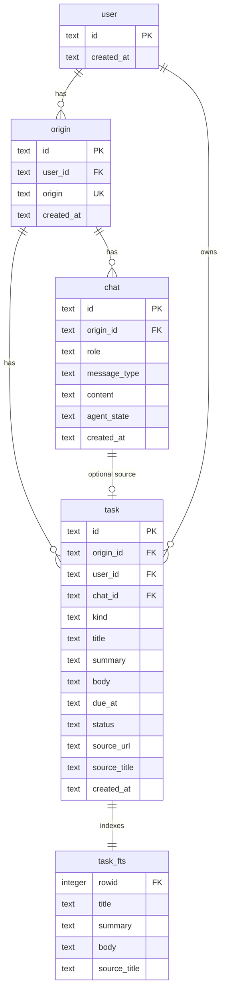

# Ezer database

SQLite persistence for the personal-assistant backend. Schema is declared in `schema.ts` and applied
on startup via `getDb()`.

**HTTP API reference:** [../routes/README.md](../routes/README.md)

**Engine:** SQLite (better-sqlite3)  
**Default path:** `./data/ezer.sqlite` (`DB_PATH` env)  
**Journal mode:** WAL  
**Foreign keys:** ON

## Conceptual model

Data is scoped in three layers:

1. **User** — identity from the client (`X-Ezer-User-Id` UUID)
2. **Origin** — browsing context per user, keyed by URL origin (e.g. `https://github.com`)
3. **Domain data** — chat messages and tasks for that origin

All pages on the same origin share one chat thread and one set of tasks for that user.

```
user
  └── origin (user_id + origin)
        ├── chat
        └── task
```

## Entity-relationship diagram



## Relationships

| Parent   | Child      | Cardinality | FK column   | On delete   |
| -------- | ---------- | ----------- | ----------- | ----------- |
| `user`   | `origin`   | 1:N         | `user_id`   | soft delete |
| `user`   | `task`     | 1:N         | `user_id`   | soft delete |
| `origin` | `chat`     | 1:N         | `origin_id` | soft delete |
| `origin` | `task`     | 1:N         | `origin_id` | —           |
| `chat`   | `task`     | 1:0..1      | `chat_id`   | —           |

All `DELETE` API routes set `deleted_at` instead of removing rows. Reads exclude rows where
`deleted_at` is set.

**Lookup keys in application code:**

| Operation             | Key                                                  |
| --------------------- | ---------------------------------------------------- |
| Resolve origin        | `(user_id, origin)`                                  |
| Load chat for a page  | `origin.id` where `origin = parsePageOrigin(tabUrl)` |
| List tasks for origin | `task.origin_id`                                     |

## Write and read paths

**Capture (write)** — `POST /captures`:

```
1. getOrCreateOrigin(userId, parsePageOrigin(tabUrl))
2. INSERT chat  — user CAPTURE (raw selection JSON)
3. LLM extract  — kind, title, summary, due_at, reply
4. INSERT task  — structured item (chat_id → user message, body = full selection)
5. INSERT chat  — ezer TEXT (reply markdown)
```

**Assistant (read)** — `POST /chat` reads notes through `searchTasksByOrigin` (FTS5 over `task_fts`)
or `listTasksByOriginId`, scoped by `origin_id` + `user_id`, and loads follow-up history through
`listRecentChatsByOriginId`. See [../services/README.md](../services/README.md).

## Module map

| File             | Table | Responsibility |
| ---------------- | ----- | -------------- |
| `soft-delete.ts` | —     | `deleted_at` helpers and query fragment |
| `user.ts`        | `user` | Get, upsert, and soft-delete client identity |
| `origin.ts`      | `origin` | Get or create origin by user + domain |
| `chat.ts`        | `chat` | Insert, list, and soft-delete messages |
| `task.ts`        | `task` | Insert, list, get, update, and FTS search (`searchTasksByOrigin`) |
| `schema.ts`      | —     | Idempotent schema (DDL statements) applied on startup |
| `index.ts`       | —     | Connection, schema application, lifecycle |

## Schema application

The app is not in production, so the schema is declared as its current state (idempotent
`CREATE ... IF NOT EXISTS` statements plus FTS5 triggers) and re-applied on every `getDb()` call.
There is no versioned migration history.

When the schema changes during development, delete the SQLite file and restart the server for a clean
slate.

## Table reference

### `user`

Client identity. Created on first authenticated request.

| Column       | Type | Constraints | Description |
| ------------ | ---- | ----------- | ----------- |
| `id`         | TEXT | PRIMARY KEY | UUID from `X-Ezer-User-Id` header |
| `created_at` | TEXT | NOT NULL    | ISO 8601 timestamp (SQLite `datetime`) |
| `deleted_at` | TEXT |             | Set by soft delete; `NULL` = active |

### `origin`

Per-user browsing context. One row per `(user_id, origin)` pair.

| Column       | Type | Constraints               | Description |
| ------------ | ---- | ------------------------- | ----------- |
| `id`         | TEXT | PRIMARY KEY               | UUID |
| `user_id`    | TEXT | NOT NULL, FK → `user(id)` | Owner |
| `origin`     | TEXT | NOT NULL                  | URL origin, e.g. `https://github.com` |
| `created_at` | TEXT | NOT NULL                  | First time this user visited this origin |
| `deleted_at` | TEXT |                           | Set by soft delete; `NULL` = active |

**Unique:** `(user_id, origin)`

**Derivation:** `origin` is parsed from the client's page URL via `new URL(tabUrl).origin` (see
`lib/parse-origin.ts`). Full page paths on the same site map to one origin row.

### `chat`

Chat messages for an origin. Ordered by `created_at`.

| Column         | Type | Constraints                 | Description |
| -------------- | ---- | --------------------------- | ----------- |
| `id`           | TEXT | PRIMARY KEY                 | UUID |
| `origin_id`    | TEXT | NOT NULL, FK → `origin(id)` | Parent origin |
| `role`         | TEXT | NOT NULL, CHECK             | `user` \| `ezer` |
| `message_type` | TEXT | NOT NULL                    | See [Message types](#message-types) |
| `content`      | TEXT | NOT NULL                    | Plain text or JSON (for `CAPTURE`) |
| `agent_state`  | TEXT |                             | JSON `{ intent, topic, keywords }` on assistant replies, for follow-ups |
| `created_at`   | TEXT | NOT NULL                    | Message timestamp |
| `deleted_at`   | TEXT |                             | Set by soft delete; `NULL` = active |

**Index:** `idx_chat_origin_created (origin_id, created_at)`

### `task`

Notes and reminders extracted from text captures.

| Column         | Type | Constraints                 | Description |
| -------------- | ---- | --------------------------- | ----------- |
| `id`           | TEXT | PRIMARY KEY                 | UUID |
| `origin_id`    | TEXT | NOT NULL, FK → `origin(id)` | Domain scope |
| `user_id`      | TEXT | NOT NULL, FK → `user(id)`   | Owner (denormalized for user-wide queries) |
| `chat_id`      | TEXT | FK → `chat(id)`, nullable   | User `CAPTURE` message that created this |
| `kind`         | TEXT | NOT NULL, CHECK             | `reminder` \| `note` |
| `title`        | TEXT | NOT NULL                    | Short label |
| `summary`      | TEXT |                             | One-line description |
| `body`         | TEXT |                             | Full captured text, indexed for note search |
| `due_at`       | TEXT |                             | ISO 8601 datetime; used for reminders |
| `status`       | TEXT | NOT NULL, DEFAULT `active`  | `active` \| `done` \| `dismissed` |
| `source_url`   | TEXT |                             | Page URL where text was selected |
| `source_title` | TEXT |                             | Page title at capture time |
| `created_at`   | TEXT | NOT NULL                    | Creation timestamp |
| `deleted_at`   | TEXT |                             | Set by soft delete; `NULL` = active |

**Indexes:**

- `idx_task_user_status_due (user_id, status, due_at)` — user to-do / reminder queries
- `idx_task_origin_created (origin_id, created_at)` — per-origin task history

### `task_fts`

FTS5 virtual table backing the assistant's note search (`POST /chat`). It is an **external-content**
index over `task` — it stores the inverted index, not the text; content is read from `task` by
`rowid`.

| Column         | Description |
| -------------- | ----------- |
| `title`        | Task title |
| `summary`      | One-line description |
| `body`         | Full captured text |
| `source_title` | Page title at capture time |

- **Tokenizer:** `porter unicode61` — English stemming, so `dam` matches `dams`.
- **Sync:** `task_fts_ai` / `task_fts_ad` / `task_fts_au` triggers keep the index in step with insert,
  delete, and update. Soft-deleted rows leave the index on update.
- **Ranking:** queries order by `bm25(task_fts)`.
- **Rebuild:** after changing the index definition, drop and recreate it, then re-index:

  ```sql
  INSERT INTO task_fts(rowid, title, summary, body, source_title)
  SELECT rowid, title, summary, body, source_title FROM task WHERE deleted_at IS NULL;
  ```

### Message types

Used in `chat.message_type`:

| Value          | Role   | `content` format |
| -------------- | ------ | ---------------- |
| `CAPTURE`      | user   | JSON: `{ text, url?, title? }` — raw page selection |
| `TEXT`         | either | Markdown plain text (typed chat and assistant replies) |
| `QUICK_ACTION` | either | Markdown; slash-menu turns (`action` on `POST /chat`) |

### Task kinds

| Value      | Meaning |
| ---------- | ------- |
| `reminder` | Something to do or follow up on; `due_at` optional |
| `note`     | Default. Reference info; no action required |

### Task status

| Value       | Meaning |
| ----------- | ------- |
| `active`    | Open / in progress |
| `done`      | Completed |
| `dismissed` | Removed from active list |
