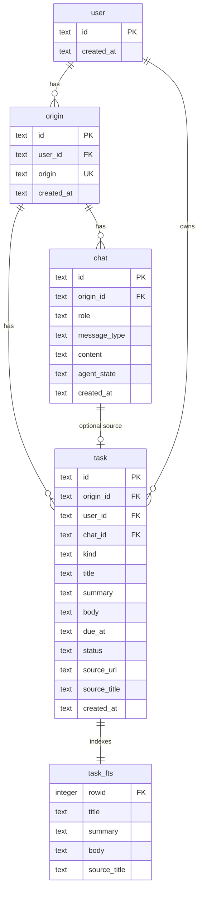

# Ezer database

SQLite persistence for the personal-assistant backend. Schema is declared in `schema.ts` and applied
on startup via `getDb()`.

**Column and table reference:** [tables.md](tables.md)  
**HTTP API reference:** [../routes/README.md](../routes/README.md)

**Engine:** SQLite (better-sqlite3)  
**Default path:** `./data/ezer.sqlite` (`DB_PATH` env)  
**Journal mode:** WAL  
**Foreign keys:** ON

## Conceptual model

Data is scoped in three layers:

1. **User** — identity from the client (`X-Ezer-User-Id` UUID)
2. **Origin** — browsing context per user, keyed by URL origin (e.g. `https://github.com`)
3. **Domain data** — chat messages and tasks for that origin

All pages on the same origin share one chat thread and one set of tasks for that user.

```
user
  └── origin (user_id + origin)
        ├── chat
        └── task
```

## Entity-relationship diagram



## Relationships

| Parent   | Child      | Cardinality | FK column   | On delete   |
| -------- | ---------- | ----------- | ----------- | ----------- |
| `user`   | `origin`   | 1:N         | `user_id`   | soft delete |
| `user`   | `task`     | 1:N         | `user_id`   | soft delete |
| `origin` | `chat`     | 1:N         | `origin_id` | soft delete |
| `origin` | `task`     | 1:N         | `origin_id` | —           |
| `chat`   | `task`     | 1:0..1      | `chat_id`   | —           |

All `DELETE` API routes set `deleted_at` instead of removing rows. Reads exclude rows where
`deleted_at` is set.

**Lookup keys in application code:**

| Operation             | Key                                                  |
| --------------------- | ---------------------------------------------------- |
| Resolve origin        | `(user_id, origin)`                                  |
| Load chat for a page  | `origin.id` where `origin = parsePageOrigin(tabUrl)` |
| List tasks for origin | `task.origin_id`                                     |

## Write and read paths

**Capture (write)** — `POST /captures`:

```
1. getOrCreateOrigin(userId, parsePageOrigin(tabUrl))
2. INSERT chat  — user CAPTURE (raw selection JSON)
3. LLM extract  — kind, title, summary, due_at, reply
4. INSERT task  — structured item (chat_id → user message, body = full selection)
5. INSERT chat  — ezer TEXT (reply markdown)
```

**Assistant (read)** — `POST /chat` reads notes through `searchTasksByOrigin` (FTS5 over `task_fts`)
or `listTasksByOriginId`, scoped by `origin_id` + `user_id`, and loads follow-up history through
`listRecentChatsByOriginId`. See [../services/README.md](../services/README.md).

## Module map

| File             | Table | Responsibility |
| ---------------- | ----- | -------------- |
| `soft-delete.ts` | —     | `deleted_at` helpers and query fragment |
| `user.ts`        | `user` | Get, upsert, and soft-delete client identity |
| `origin.ts`      | `origin` | Get or create origin by user + domain |
| `chat.ts`        | `chat` | Insert, list, and soft-delete messages |
| `task.ts`        | `task` | Insert, list, get, update, and FTS search (`searchTasksByOrigin`) |
| `schema.ts`      | —     | Idempotent schema (DDL statements) applied on startup |
| `index.ts`       | —     | Connection, schema application, lifecycle |

## Schema application

The app is not in production, so the schema is declared as its current state (idempotent
`CREATE ... IF NOT EXISTS` statements plus FTS5 triggers) and re-applied on every `getDb()` call.
There is no versioned migration history.

When the schema changes during development, delete the SQLite file and restart the server for a clean
slate.
